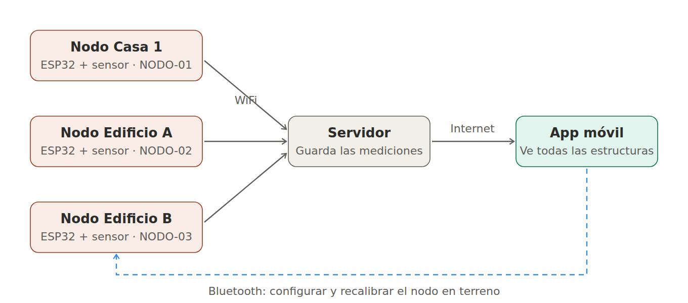

# PROYECT-IOT — Monitor de salud estructural

Proyecto de la asignatura **TI3042 · Aplicaciones Móviles para IoT (INACAP)**.

Sistema IoT que detecta **pérdida de rigidez en estructuras** analizando su frecuencia natural de vibración. Toda estructura vibra a una frecuencia que depende de su masa y su rigidez: si se daña, pierde rigidez y esa frecuencia **baja**, aunque el daño todavía no se vea. El sistema mide la vibración, calcula la frecuencia con una **FFT** y la compara con la línea base de la estructura sana.

**ODS:** 11 (meta 11.5) y 9 (meta 9.1).

---

## Estados

| Color | Estado | Condición | Significado |
|---|---|---|---|
| Rojo | `ALERTA` | La frecuencia cae sobre el umbral | Pérdida de rigidez: revisión estructural |
| Amarillo | `VIBRACION` | Amplitud alta, frecuencia estable | Sismo en curso, sin daño detectado |
| Verde | `NORMAL` | Frecuencia cerca de la línea base | Estructura sana |
| Gris | *sin datos* | No llegan tramas | Nodo desconectado (lo detecta el receptor/app) |

Prioridad: **rojo > amarillo > verde**. Un sismo hace oscilar fuerte la estructura (amplitud alta) pero su frecuencia vuelve al centro; un daño deja la frecuencia **baja de forma permanente**.

## Trama

Cada nodo envía una línea por medición:

```
ID;ESTADO;frecuencia;linea_base;variacion;amplitud
NODO-01;ALERTA;29.69;39.06;24.0;28444
```

El **ID** permite monitorear **varias estructuras** a la vez: la app agrupa las mediciones por nodo.

## Arquitectura

- **Prototipo actual (probado):** un nodo sobre Arduino Uno. La trama sale por el puerto serie.
- **Diseño con ESP32 (programado, sin verificación física):** nodo sensor + nodo base enlazados por Bluetooth Classic (SPP).


- **Proyección con varias estructuras:** cada nodo ESP32 envía sus datos por **WiFi** a un servidor (ej. Firebase) y la app móvil los lee desde ahí. Bluetooth queda para **configurar y recalibrar el nodo en terreno**, lo que además impide recalibraciones remotas no autorizadas.

---

## Estructura del repositorio

```
firmware/
  arduino_uno/ProyectoMonitorEstructural/   Prototipo que funciona en físico (Uno)
  esp32/nodo_sensor/                         Nodo que mide y calcula la FFT (maestro BT)
  esp32/nodo_base/                           Nodo que recibe y alerta (esclavo BT)
simulacion/
  wokwi_uno/                                 Proyecto Wokwi del Uno (diagram.json + sketch)
  wokwi_esp32/                               Sketch de un nodo ESP32 completo
docs/
  informes/                                  EF1, ES1 e Informe Unidad 2
  mockup/                                    Propuestas de pantallas de la app
  guias/                                     Armado, verificación, materiales y chuleta
  respaldo_estadistico.md                    Datos 27F y CASEN con fuentes
```

Simulación ESP32 en Wokwi: https://wokwi.com/projects/474167699552138241

---

## Prototipo Arduino Uno

| Pieza | Pin |
|---|---|
| Potenciómetro (centro) | A0 |
| Potenciómetro de amplitud (opcional) | A1 |
| Pulsador (diagonal a GND) | D2 |
| LED verde (con 220 Ω) | D6 |
| LED rojo (con 220 Ω) | D7 |
| Buzzer | D8 |
| MPU6050 SDA / SCL (modo real) | A4 / A5 |

**Librería:** `arduinoFFT`. Monitor serie a **115200**.

**Demo:** potenciómetro alto → pulsador **mantenido 3 s** (registra la línea base) → potenciómetro bajo → LED rojo y buzzer. Para mostrar el amarillo, conectar un segundo potenciómetro en A1 y poner `USAR_POTE_AMPLITUD = true`: al subirlo se encienden verde y rojo juntos.

### Parámetros principales

| Constante | Uno | ESP32 | Motivo |
|---|---|---|---|
| `SAMPLES` | 128 | 512 | La RAM del Uno (2 KB) no admite más |
| Resolución | 1,56 Hz | 0,39 Hz | Fs / SAMPLES |
| `UMBRAL_CAIDA` | 10 % | 5 % | Con 1,56 Hz de resolución, 5 % daría falsas alarmas |
| `AMPLITUD_SISMO` | 60000 | 230000 | ~1,7× la amplitud en reposo de la señal patrón |
| `ID_NODO` | `NODO-01` | `NODO-01` | Cambiar en cada placa |

`MODO_SIMULACION = true` genera una señal patrón con el potenciómetro (validación del algoritmo). En `false` lee el MPU6050 real.

---

## Estado del proyecto

- [x] Unidad 1 — prototipo Arduino funcional, informes EF1 y ES1
- [x] Modelo de varias estructuras: ID por nodo y estado amarillo por amplitud
- [x] Recalibración protegida (pulsador mantenido 3 s)
- [x] Informe Unidad 2 con todas las actualizaciones
- [ ] Verificación física del enlace Bluetooth entre dos ESP32
- [ ] Unidad 2 — app Android (Kotlin): inicio de sesión, lista de estructuras, detalle
- [ ] Unidad 3 — integración app ↔ nodos
- [ ] Unidad 4 — informe final
