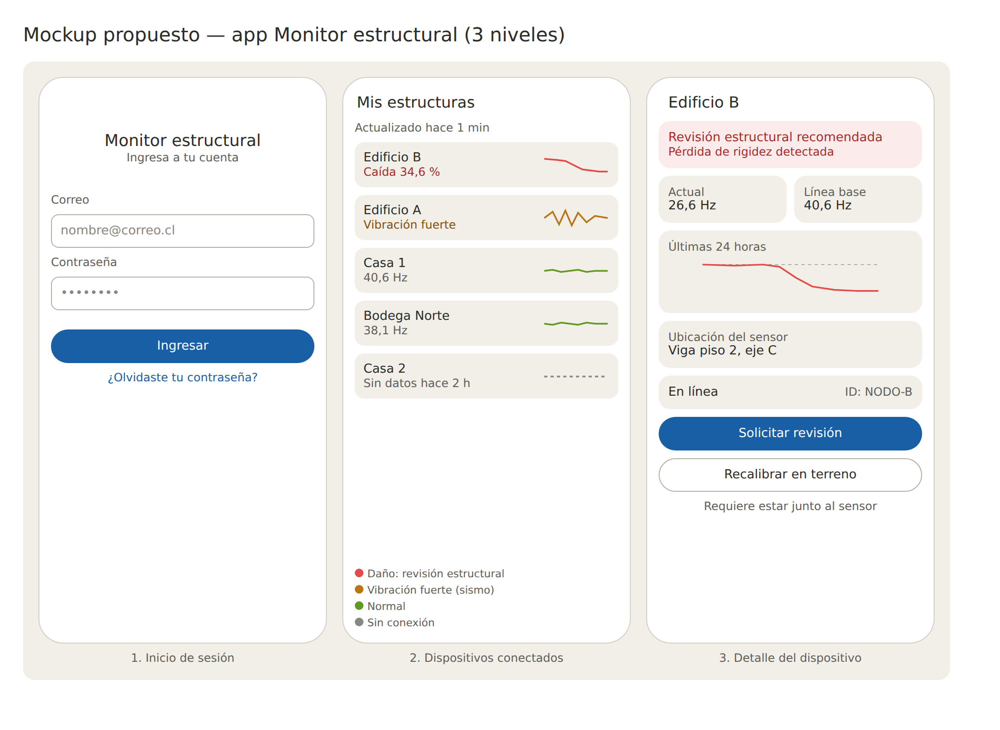

# Mockups de la app (Unidad 2)

Tres niveles: inicio de sesión, lista de estructuras (dispositivos conectados) y detalle del dispositivo.

| Archivo | Descripción |
|---|---|
| `mockup_claude_v4.png` | Vista previa de la propuesta |
| `mockup_claude_v4.html` | Misma propuesta, abrir en el navegador |

Pendiente: agregar el mockup de Figma/Canva del compañero para comparar ambas propuestas.

